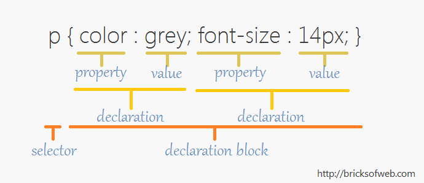

## <b>Feb 1<br/> Semantic HTML & CSS</b>

### HTML Recap
* ```span``` - display "inline"
* ```div``` - display "block"
* Introducing the ``class="class-name"`` and ``id="id-name"`` attributes.
* [Google's HTML/CSS Style guide for class/id naming](https://google.github.io/styleguide/htmlcssguide.xml#ID_and_Class_Naming)

### Semantic HTML
###### New Semantic Elements in HTML5 are supported by all modern browsers (except for Internet Explorer 8), according to http://caniuse.com/#feat=html5semantic
* ```<header>``` - introduction for a section, or for the body. Read more at [w3c html spec](https://www.w3.org/html/wg/drafts/html/master/semantics.html#the-body-element)
* ```<article>``` -  "a self-contained item that is, in principle, independently distributable or reusable, e.g. in syndication. Examples: A forum post, a magazine or newspaper article, a blog entry, a user-submitted comment, an interactive widget or gadget, or any other independent item of content." (via [w3c html spec](https://www.w3.org/html/wg/drafts/html/master/semantics.html#the-article-element))
* ```<section>``` - "thematic grouping of content." "Examples of sections would be chapters, the various tabbed pages in a tabbed dialog box, or the numbered sections of a thesis. A Web site's home page could be split into sections for an introduction, news items, and contact information." (via [w3c html spec](https://www.w3.org/html/wg/drafts/html/master/semantics.html#the-section-element))
* ```<nav>``` - "major navigation block" [via w3c html spec](https://www.w3.org/html/wg/drafts/html/master/semantics.html#the-nav-element)
* ```<aside>``` - content that is not directly related to the surrounding content. For example, a twitter feed, advertising, links to other websites, links to other content on this website, or a pull quote from the article that repeats something from the article (i.e. it is not an essential part of the article). Read more at [w3c](https://www.w3.org/html/wg/drafts/html/master/semantics.html#the-aside-element).
* ```<figure>``` - a self contained unit, optionally with a caption (```figcaption```). Often used for images. Read more at [w3c](https://www.w3.org/html/wg/drafts/html/master/semantics.html#the-figure-element).
* ```<main>``` - Contains the main content of the page. It can only be used once per page. Read more at [w3c](https://www.w3.org/html/wg/drafts/html/master/semantics.html#the-main-element) and [html5doctor](http://html5doctor.com/the-main-element/). 
* ```<time>``` - Use with a machine-readable timestamp in the ``datetime`` attribute, and a human-readable description. Example:   ```<time datetime="2005-10-07">October</time>```. Read more at [CSS Tricks](https://css-tricks.com/time-element/).
* ```<mark>``` - Used to <mark>highlight</mark> text. Read more [here](https://developer.mozilla.org/en-US/docs/Web/HTML/Element/mark).

### CSS - Cascading Style Sheet
* Syntax:
    * Selector
    * Declaration Block
    * Property
    * Value
    * Comments: 
```/*this is a comment/*```


* Selector Types:
    * Universal: ```*```
    * Element: ``li``
    * Class: ```.class-name```
    * Pseuo-Element: ``a:hover``, ``li:first-child``, ``li:before``
    * Pseudo-class: ```.class-name:hover```
    * ID: ```#id-name```
    * Child (direct descendant): ``li > a``
    * Descendant (any child): ``li a``
    * Read more: http://www.w3schools.com/cssref/css_selectors.asp
* Rules can have multiple selectors, separated by commas, i.e.

```
p, div {
  display: inline;
}
```
* Cascade Specificity
    * Order:
        1. inline ``style=`` tag is most specific (but don't use it!)
        2. ID tag
        3. class / psuedoclass
        4. Elements / pseudo-elements
    * From there, last rule wins! It's the order they are listed on the page. If two rules conflict, the last rule overwrites the first rule.
    * Read more: [CSS Specificity Things You Should Know](https://www.smashingmagazine.com/2007/07/css-specificity-things-you-should-know/)
* Inheritance
    * An element's style properties can be automatically inherited from ``body``, or with ``inherit`` to specify that they should inherit from parent element.
    * Read more: https://www.smashingmagazine.com/2010/04/css-specificity-and-inheritance/#3-inheritance

### Example from class (updated):
https://d157rqmxrxj6ey.cloudfront.net/jasonsigal/29538/

### HW:
* Start a CSS Tutorial of your choice. Some recommendations [here](../readings_resources.html) include:
    * Book: HTML & CSS by Jon Duckett*
    * Head First HTML with CSS & XHTML by Elizabeth & Eric Freeman **
    * Book: [CSS3 for Web Designers](http://www.abookapart.com/products/css3-for-web-designers) by Dan Cederholm
    * http://learn.shayhowe.com/
    * [w3 css tutorial](http://www.w3schools.com/css/default.asp)
    * Many more resources can be found [here](https://github.com/vhf/free-programming-books/blob/master/free-programming-books.md#html--css) (a list of free programming books!).
* Read "[How We Really Use the Web](http://www.sensible.com/chapter.html)" from Steve Krug's book <i>Don't Make Me Think</i>. If you want, you can also read "[Billboard Design 101](http://www.pcworld.com/article/137231/article.html)" (it will be assigned in a future reading).
* Skim "[What You Think You Know About The Web Is Wrong](http://time.com/12933/what-you-think-you-know-about-the-web-is-wrong/)"
* Start work on your [project plan](../assignments/project_plan.html) for the midterm. Be prepared to describe the goal of your website for the class on Wednesday.
